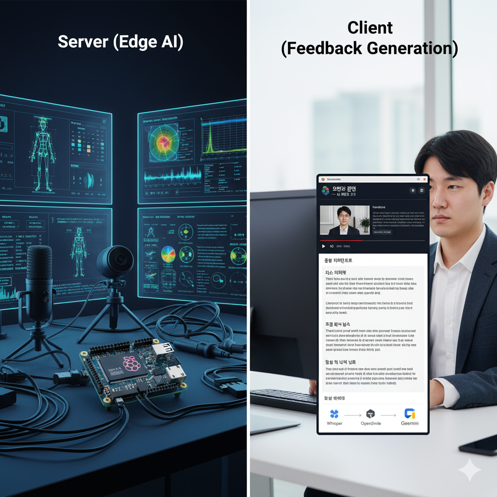
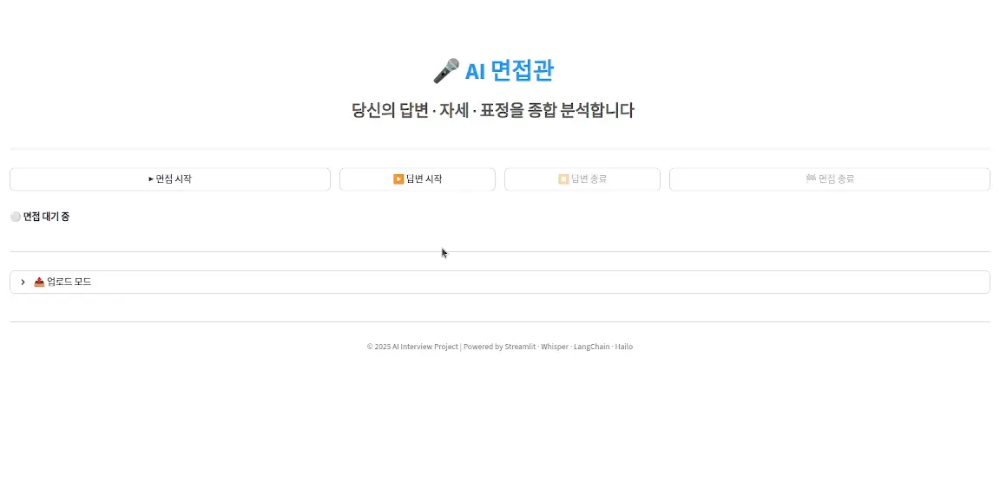
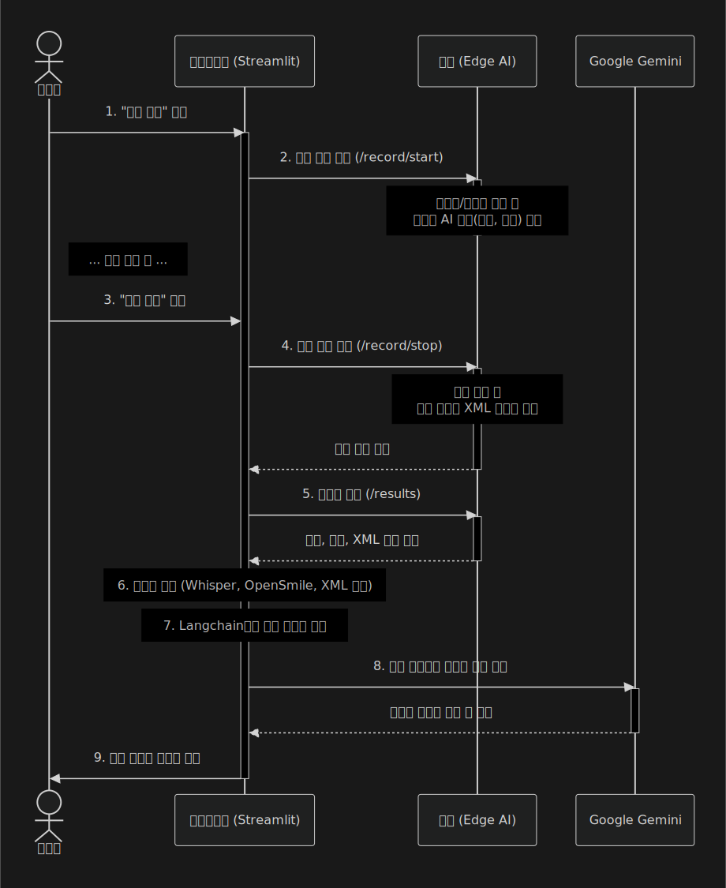

# 오만과 편견 (Pride and Prejudice)

***사용자의 '오만(무의식적 습관)'과 면접관의 '편견'을 극복하는 가상 면접 피드백 시스템***

본 프로젝트는 면접을 준비하는 사용자에게 AI 기반의 종합적인 피드백을 제공하는 시스템입니다.

사용자의 시각적 요소(자세, 표정)와 청각적 요소(목소리 톤, 답변 내용)를 실시간으로 분석하고, 면접 종료 후 Google Gemini (LLM)를 통해 개선점을 담은 상세한 리포트를 제공합니다.

 

## 🏛️ 시스템 아키텍처 (System Architecture)

이 시스템은 실시간 데이터 수집 및 AI 추론을 담당하는 **Edge AI 서버**와, 데이터를 취합하여 사용자에게 피드백을 생성/제공하는 **클라이언트 애플리케이션**으로 구성됩니다.
<!-- 

 -->

 | 
---|---|

<!-- 
   
 -->

### 1\. Edge AI 서버 (Server)

  * **역할:** 면접자의 영상과 음성을 실시간으로 수집하고 AI 모델을 통해 분석합니다.
  * **하드웨어:** Raspberry Pi 5 (+ Hailo-8) 또는 Jetson Nano
  * **주요 기능:**
      * GStreamer와 RTSP를 통해 카메라 입력을 받아 면접자의 **얼굴 표정**(예: 웃음 여부)과 **신체 자세**(예: 바른 자세 여부)를 실시간으로 추론합니다. (TensorFlow, OpenCV, HailoRT, TensorRT 활용)
      * 분석된 데이터를 시간대별로 태깅하여 `xml` 특징 파일로 생성합니다.
      * Flask 기반의 RESTful API를 통해 클라이언트의 요청 시 녹화된 영상/음성 원본과 `xml` 파일을 전송합니다.

 

### 2\. 클라이언트 (Client)

  * **역할:** 서버로부터 데이터를 받아 사용자에게 보여주고, LLM을 통해 최종 피드백을 생성합니다.
  * **주요 기능:**
      * Streamlit 기반의 UI를 통해 사용자로부터 면접 시작/종료 명령을 받습니다.
      * 서버에 녹화 결과물(영상, 음성, `xml`)을 요청하고 다운로드합니다.
      * **음성 분석:**
          * `Whisper`를 사용해 음성 파일을 텍스트(답변 내용)로 변환합니다.
          * `OpenSmile`을 사용해 목소리 떨림, 톤, 말의 빠르기 등 음향적 특징을 추출합니다.
      * **LLM 피드백 생성:**
          * `Langchain`을 사용하여 [서버의 `xml` 데이터 (자세, 표정)] + [클라이언트의 분석 데이터 (답변 내용, 목소리 특징)]를 종합합니다.
          * 모든 데이터를 Google Gemini (LLM)에 전송하여 "면접관"의 관점에서 상세한 피드백 리포트를 생성합니다.

## ⚙️ 작동 흐름 (Workflow)

1.  **(Client)** 사용자가 Streamlit 앱에서 "면접 시작" 버튼을 누릅니다.
2.  **(Server)** 클라이언트의 요청을 받아 카메라/마이크 녹화를 시작함과 동시에 AI 추론(자세, 표정)을 시작합니다.
3.  **(Client)** 사용자가 "면접 종료" 버튼을 누릅니다.
4.  **(Server)** 녹화를 중지하고, 수집된 특징 데이터를 `xml` 파일로 최종 정리합니다.
5.  **(Client)** 서버에 결과물을 요청하여 영상, 음성, `xml` 파일을 다운로드합니다.
6.  **(Client)** `Whisper`와 `OpenSmile`로 음성 파일을 분석하고, `xml` 파일을 파싱합니다.
7.  **(Client)** `Langchain`을 통해 모든 데이터를 취합하여 Google Gemini API에 전송합니다.
8.  **(Client)** LLM이 생성한 피드백 리포트(개선점, 칭찬 등)를 사용자에게 보여줍니다.

## 💻 기술 스택 (Tech Stack)

### Server (Edge AI)

  * **Language:** Python
  * **AI/ML:** HailoRT, TensorRT, TensorFlow, OpenCV
  * **Media:** GStreamer, RTSP
  * **API:** Flask

### Client (Feedback Generation)

  * **Language:** Python
  * **Framework:** Streamlit
  * **LLM Orchestration:** Langchain
  * **Audio Analysis:** Whisper (STT), OpenSmile (Acoustic Features)

### LLM

  * Google Gemini (via Google AI Studio)

## 🛠️ 구성 요소별 상세 (Component Details)

이 섹션에서는 각 모듈(서버, 클라이언트, AI 모델)의 설계 이념과 상세 구조에 대해 설명합니다.

### 1\. Edge AI 서버 (Server)

  * **설계:** Edge AI 서버는 실시간 영상/음성 스트리밍과 AI 추론을 동시에 수행하도록 설계되었습니다. GStreamer와 RTSP를 통해 미디어 파이프라인을 구축하고, Hailo-8 또는 TensorRT를 활용하여 AI 모델을 하드웨어 가속합니다.
  * **상세 구조:** Raspberry Pi 또는 Jetson Nano 환경에서의 상세한 아키텍처 및 설정은 아래 문서를 참조하세요.
      * [Raspberry Pi 서버 가이드](./pi_server/GUIDE.md)
      * [Jetson Nano 서버 가이드](./jetson_server/GUIDE.md)

### 2\. 클라이언트 (Client)

  * **설계:** 클라이언트는 사용자 친화적인 UI(Streamlit)를 제공하고, 서버로부터 받은 데이터를 종합하여 LLM(Gemini)에 전달하는 오케스트레이션 역할을 담당합니다. Whisper, OpenSmile을 통해 복합적인 음성 분석을 수행합니다.
  * **상세 구조:** 클라이언트의 작동 방식과 Langchain을 활용한 프롬프트 구성 등 상세 내용은 아래 문서를 참조하세요.
      * [클라이언트 가이드](./client/GUIDE.md)

### 3\. AI 모델 (AI Models)

  * **설계:** 면접자의 비언어적 요소를 정량화하기 위해 자체 학습된 표정 인식 모델과 고성능 자세 추정 모델을 사용합니다.
  * **상세 내용:** 자체 개발한 표정 인식 모델에 대한 상세 내용은 관련 문서를 참조하세요.
      * [RPi5 표정 인식 모델(분류) 가이드](./keras/README_CLASSIFICATION.md)
      * [Rpi5 표정 인식 모델(도메인) 가이드](./keras/README_DOMAIN.md)
      * [Rpi5 자세 추정 모델 출처](https://github.com/hailo-ai/hailo_model_zoo/blob/master/docs/public_models/HAILO8/HAILO8_single_person_pose_estimation.rst)
      * [Jetson Nano 표정 인식 및 자세 추정 모델 가이드](https://github.com/won-jong-wan/Pride-and-Prejudice/blob/jetson-dev/jetson_server/GUIDE.md)
      * [Jetson Nano 자세 추정 모델 출처](https://www.tensorflow.org/hub/tutorials/movenet?hl=ko)
   

## 🚀 설치 및 실행 방법 (Setup & Usage)

프로젝트를 로컬 환경에서 실행하기 위한 설치 및 실행 가이드입니다.

### 1\. 서버 (Server)

  * 아래 가이드에 따라 Edge AI 서버(Raspberry Pi 또는 Jetson Nano)를 먼저 설정하고 실행합니다.
    * [Raspberry Pi 서버 설치 가이드](./pi_server/README.md)
    * [Jetson Nano 서버 설치 가이드](./jetson_server/README.md)

### 2\. 클라이언트 (Client)

  * 서버 실행 후, 아래 가이드에 따라 클라이언트 애플리케이션을 실행합니다.
    * [클라이언트 실행 가이드](./client/README.md)
