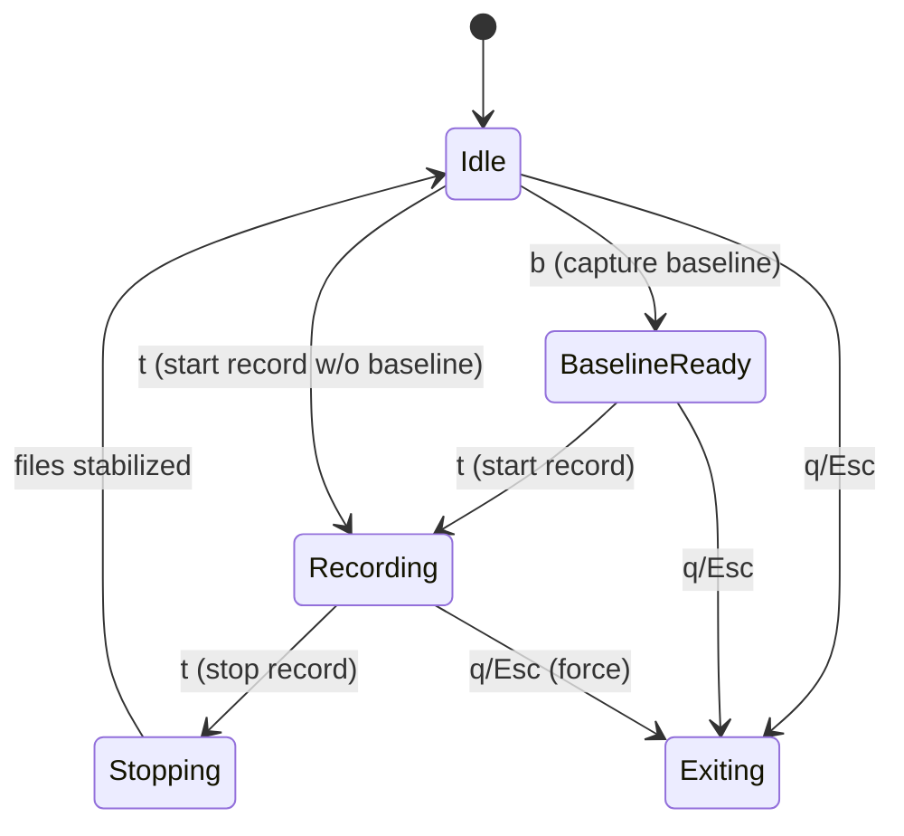

# Jetson FER+Posture System — Technical Overview (Features · Architecture · Execution Flow)

> 본 문서는 **설치(install)** 내용을 제외하고, 업로드된 소스(`run_3cls_audio2.py`, `process_call.py`, `server.py`, `trt_utils.py`)의 **주요 기능**, **구조**, **실행 흐름**을 구체적으로 설명합니다.

## 1) 핵심 기능 요약
- **실시간 추론**: 카메라 프레임에서 **포즈(MoveNet TRT)**와 **표정(3‑class FER TRT)**를 동시 추론
- **오버레이 시각화**: 스켈레톤/얼굴 박스/표정 라벨/비율/상태 HUD를 화면에 합성
- **녹화 파이프라인**: **원본 영상**과 **오버레이 영상**을 동시 저장, **마이크 오디오**를 별도 WAV로 병렬 기록
- **이벤트 로깅(XML)**: Baseline 대비 **자세 품질**/ **부정 감정 비율**/ **다리 떨림** 등 이벤트를 XML로 기록
- **서버 제어(Flask)**: HTTP API로 **시작/정지/상태/다운로드/로그 조회** 제어 (GUI 창에 키 자동전송)
- **안정 종료**: 녹화 정지 후 파일 **사이즈 안정화** 대기 → 창 종료 순으로 안전하게 마무리

## 2) 구성 요소(Modules)와 역할
### 2.1 `run_3cls_audio2.py` — 메인 추론 & 녹화
- **입력 소스**: `--src`(기본 3), 파일/장치/RTSP 모두 가능 (OpenCV VideoCapture)
- **TensorRT 추론**: `trt_utils.TRTModule`로 **FER**(`face_3cls.engine`), **Pose**(`pose_movenet.engine`) 실행
- **Face ROI 추출**: 포즈 키포인트에서 얼굴 후보를 우선 추정, 실패 시 **Haar Cascade**로 폴백
- **FER 후처리**: TTA Flip, 감마/CLAHE, **온도(temperature)**/ **지수평활**로 노이즈 감소
- **자세 스코어링**: Baseline과의 상대적인 어깨/허리 라인/머리 각도 등을 활용한 규칙 기반 점수
- **다리 떨림**: 하체 ROI의 프레임별 변화량 시퀀스를 **간단 FFT**로 스펙트럼 에너지 감지
- **키 조작**: `b`(baseline), `t`(녹화 토글), `r`(baseline 해제), `o`(90° 회전), `q/Esc`(종료)
- **출력**: mp4(원본/오버레이), wav(마이크), xml(이벤트). `--out_dir` 사용 시 고정 파일명 생성

### 2.2 `trt_utils.py` — TensorRT 래퍼
- **엔진 로딩/바인딩**: `tensorrt` + `pycuda`로 입력/출력 버퍼 관리, 동기 추론 `infer()` 제공
- **입출력 전처리**: 배치, shape, dtype 캐스팅 지원 (float32/FP16 변환 등)
- **리소스 수명주기**: 컨텍스트/스트림/버퍼를 객체로 보유해 프레임마다 빠른 추론 가능

### 2.3 `process_call.py` — 외부 프로세스 & 키 전송 매니저
- **프로세스 실행**: `subprocess.Popen`으로 `run_3cls_audio2.py` 실행 및 표준출력/로그 파일 기록
- **키 자동전송**: `xdotool`로 활성 창에 **b→t**(시작) / **t→q**(정지/종료)
- **파일 안정화**: 녹화 정지 후 mp4/wav/xml **size 안정 체크** 루프 → 완료 시 응답 반환
- **로그 관리**: 실행 로그 위치와 tail 인터페이스 제공

### 2.4 `server.py` — Flask HTTP API 서버
- **엔드포인트**: `/command/start_record`, `/command/stop_record`, `/api/status`, `/download/<kind>/<name>`, `/debug/log`
- **상태 관리**: 현재 실행 여부, 마지막 실행 커맨드, 최근 생성 파일 목록(mp4/wav/xml)
- **고정 출력 경로**: 서버 모드에서는 내부적으로 `--out_dir`를 강제 지정해 **고정 파일명**으로 결과 저장

## 3) 실행 흐름(End-to-End)
### 3.1 단독 실행(로컬)
1. 사용자가 터미널에서 `run_3cls_audio2.py` 실행 → 카메라 오픈/엔진 로딩/윈도우 생성
2. **b** 입력 시 Baseline 캡처 → 내부 상태를 *BaselineReady*로 전환
3. **t** 입력 시 녹화 시작 → 원본/오버레이 VideoWriter 오픈, arecord 프로세스 시작
4. 루프: 프레임 읽기 → 전처리 → Pose/FER 추론 → 스코어링/라벨링 → 오버레이 합성 → 화면/파일 출력
5. Baseline ON + 조건 충족 시 XML에 이벤트 노드 append (시간/유형/강도 등)
6. **t** 입력 시 녹화 정지 → VideoWriter/arecord 종료 → 파일 사이즈 안정 후 대기
7. **q** 또는 **Esc** 입력 시 루프 종료 → 자원 해제 후 프로그램 종료

### 3.2 서버 실행(HTTP API)
1. 사용자가 `server.py` 실행 → Flask 서버 기동
2. `GET /command/start_record?src=<n>` 호출 → `process_call.py`가 추론 앱을 실행하고 **b→t**를 순차 전송
3. 추론 앱은 GUI 창에서 Baseline/녹화를 시작하고, 결과를 **고정 경로**로 저장
4. `GET /command/stop_record` 호출 → **t**로 녹화 정지, 파일 **안정화 대기** 후 **q**로 종료
5. `GET /api/status`로 현재 상태/최신 파일 확인, `GET /download/...`로 결과 다운로드

## 4) 상태 다이어그램(State Machine)


## 5) 데이터 파이프라인(프레임 처리)
```mermaid
flowchart LR
    A[VideoCapture] -->|BGR frame| B[Resize/Rotate/Normalize]
    B --> C[Pose TRT]
    B --> D[Face ROI (from Pose)]
    D -->|fallback| E[Haar Cascade]
    D --> F[FER TRT]
    E --> F
    C --> G[Posture Scoring]
    F --> H[FER Smoothing/Temp]
    G --> I[Event Logic]
    H --> I
    B --> J[Overlay Compose]
    I --> K[XML Writer]
    J --> L[Display]
    J --> M[VideoWriter(annot)]
    A --> N[VideoWriter(raw)]
    O[Mic arecord] --> P[WAV]
```

## 6) 파일 I/O 규칙
- **단독 실행(기본)**: `/home/jetson10/fer/{mp4,wav,xml}` 하위에 **타임스탬프 기반 파일명** 생성
  - 예) `mp4/rec_YYYYmmdd_HHMMSS_annot.mp4`, `mp4/rec_..._raw.mp4`, `wav/rec_... .wav`, `xml/xml_... .xml`
- **서버 모드**: `--out_dir /home/jetson10/fer/server/srv_tmp`로 고정 폴더 + **고정 파일명**(`video_ai.mp4`, `video.mp4`, `audio.wav`, `log.xml`)
- **안정화 대기**: 정지 직후 파일이 완전히 flush될 때까지 **size 변화가 멈출 때**까지 대기 후 응답

## 7) Flask API 상세
| Method | Path | Query | 동작 | 응답 요약 |
|---|---|---|---|---|
| GET | `/command/start_record` | `src`(int) | 앱 실행 → `b→t` 전송 → 녹화 시작 | `{ok, path(log), tail, files}` |
| GET | `/command/stop_record` | - | `t`로 정지 → 파일 안정화 대기 → `q` 종료 | `{ok, files}` |
| GET | `/api/status` | - | 실행 중 여부/마지막 커맨드/최신 파일 목록 | `{running, last_cmd, files}` |
| GET | `/download/<kind>/<name>` | kind=`mp4|wav|xml` | 파일 스트리밍 | 바이너리 |
| GET | `/debug/log` | - | 마지막 로그 tail | 텍스트 |

## 8) 주요 알고리즘 & 로직 포인트
- **Baseline 비교**: 첫 자세를 기준선으로 저장 후, 기울기/비대칭/상체각도를 지속 비교해 **좋음/보통/나쁨** 등급 판정
- **감정 비율 HUD**: 프레임별 FER 결과를 누적/슬라이딩 윈도우로 집계 → 비율 표시
- **다리 떨림**: 하체 ROI에서 프레임간 차분 → 시계열 FFT → 특정 주파수 대역 에너지 임계값 초과 시 이벤트
- **XML 스키마(요지)**: `<session>` 루트 하에 `<event type="negative_emotion|bad_posture|leg_shake" severity="low|mid|high" t0="..." t1="..."/>`를 누적
- **퍼포먼스 스위치**: `--frame_skip`, `--process_every`, `--max_side`로 CPU/GPU 부하 관리
- **화질 보정**: `--fer_gamma`, `--fer_clahe`, `--fer_tta_flip`, `--fer_temp`로 FER 안정화

## 9) 오류/예외 처리(개요)
- **카메라 실패**: OpenCV 캡처 실패 시 즉시 종료 또는 재시도 루틴 (로그로 원인 출력)
- **엔진 로딩 실패**: 경로 불일치/버전 불일치 시 예외 → 표준에러/로그 기록 후 중단
- **오디오 장치 오류**: `arecord` 실패 시 경고 후 비디오만 진행 가능; 서버 응답에는 오류 메시지 포함
- **GUI/키 전송 실패**: 표시 화면이 없거나 포커스가 없으면 키 전송 실패 → 서버는 에러 반환
- **파일 접근 충돌**: 기존 파일 핸들이 열려있으면 새로 열기 실패 → 파일명 분기 또는 대기 후 재시도

## 10) 확장/커스터마이징 포인트
- **엔진 교체**: `scripts/face_3cls.engine`, `pose_movenet.engine`을 교체해도 I/O shape만 맞으면 그대로 동작
- **라벨 커스터마이즈**: `--fer_labels "neg,neu,pos"` 포맷으로 라벨 텍스트 변경 가능
- **추가 규칙**: 자세 평가 규칙/임계값을 함수 분리하여 프로젝트 특성에 맞게 조정
- **소스 확장**: RTSP/파일 입력 지원(예: `--src rtsp://...`) 및 `--process_every`로 파일 처리 속도 제어
- **웹 UI 연동**: Flask API를 프론트엔드(React/Vue 등)에서 호출해 원격 제어/다운로드/요약 리포트 제공

## 11) 디렉터리 레이아웃(권장)
```
/home/jetson10/fer
├── scripts/
│   ├── run_3cls_audio2.py      # 메인 추론/녹화
│   ├── trt_utils.py            # TensorRT 래퍼
│   ├── face_3cls.engine        # FER 엔진
│   └── pose_movenet.engine     # Pose 엔진
└── server/
    ├── server.py               # Flask API 서버
    ├── process_call.py         # 프로세스/키/안정화 매니저
    └── srv_tmp/
        ├── mp4/
        ├── wav/
        └── xml/
```

## 12) 체크리스트(운영 전)
- [ ] GUI 세션에서 실행(로컬 모니터/VNC) — `xdotool` 키 입력이 가시 창에 도달하는지 확인
- [ ] 카메라/마이크 디바이스 인식 — `v4l2-ctl --list-devices`, `arecord -l`
- [ ] 엔진 파일 경로 일치 — `scripts/face_3cls.engine`, `scripts/pose_movenet.engine`
- [ ] 디스크 용량/쓰기 권한 확보 — mp4/wav/xml 생성 가능한지 사전 테스트
- [ ] 네트워크 포트 5000 오픈(서버 모드) — 방화벽/포트 충돌 여부 체크
