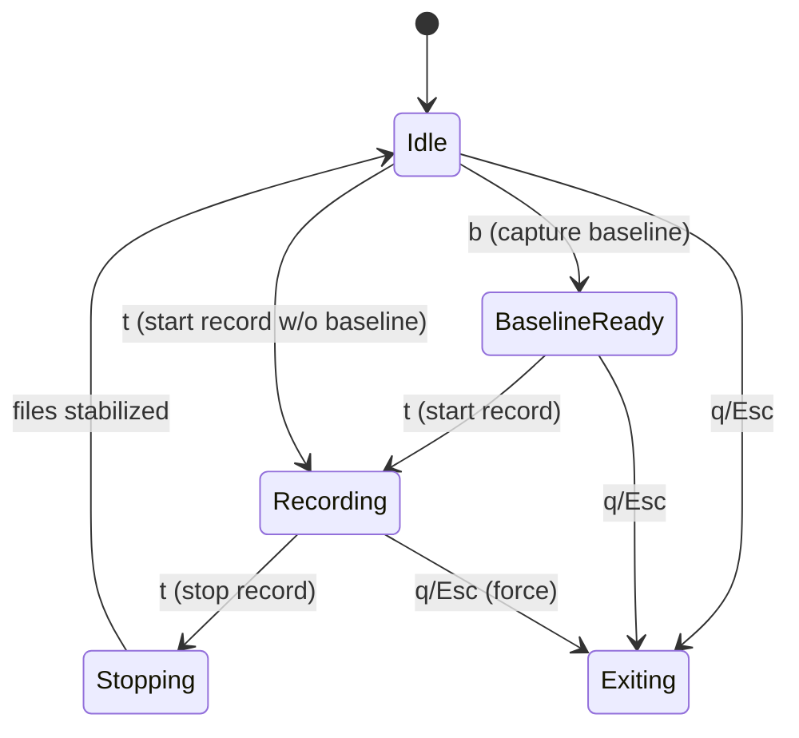
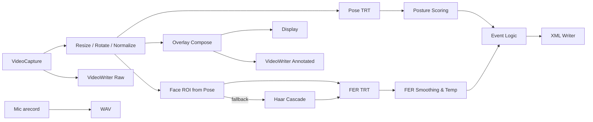

# Interview Assist System — Jetson Nano Edition
Edge AI 면접 보조 시스템 (Jetson Nano + TensorRT)

실시간 자세/표정 추론과 녹화/로그 수집, 그리고 클라이언트의 LLM 종합 피드백까지 한 번에.

## 🏛️ 시스템 아키텍처 (System Architecture)
이 시스템은 Edge AI 서버(Jetson Nano) 와 클라이언트 애플리케이션으로 구성됩니다.

서버는 실시간 데이터 수집·AI 추론·녹화/로그 저장을 담당하고, 클라이언트는 결과 수집·음성 분석·LLM 피드백 생성을 수행합니다.

## 🏞️ 시연 영상 (Demo)


## Edge AI 서버 (Server)
역할: 면접자의 영상/음성을 실시간으로 수집하고 AI 모델로 분석합니다.

하드웨어: Jetson Nano (+ USB Webcam / RealSense)

가속기/프레임워크: TensorRT, OpenCV
주요 기능
- 실시간 추론: 자세(좋음/보통/나쁨) · 표정(웃음/중립/부정) 인식
- 입력 파이프라인
- 간단: OpenCV VideoCapture로 /dev/videoN 직접 캡처
- 로깅: 이벤트를 시간대별 태깅하여 XML 특징 파일 생성
- 녹화: 주석 영상(*_annot.mp4) · 원본(*_raw.mp4), 오디오(.wav) 저장
- API: Flask 기반 REST 엔드포인트로 녹화/다운로드 제어

추천 실행 (단일 스크립트 모드)
- python3 run_3cls_audio2.py --src 3 --width 640 --height 480 --fps 30 --show_fps

핫키: b(베이스라인 시작) / r(해제) / t(녹화 토글) / o(90° 회전) / q|ESC(종료)
산출물 경로
- 비디오: mp4/rec_YYYYMMDD_HHMMSS_annot.mp4, mp4/rec_YYYYMMDD_HHMMSS_raw.mp4
- 오디오: wav/rec_YYYYMMDD_HHMMSS.wav
- XML: xml/xml_YYYYMMDD_HHMMSS.xml

## 1) 핵심 기능 요약
- **실시간 추론**: 카메라 프레임에서 **포즈(MoveNet TRT)**와 **표정(3‑class FER TRT)**를 동시 추론
- **오버레이 시각화**: 스켈레톤/얼굴 박스/표정 라벨/비율/상태 HUD를 화면에 합성
- **녹화 파이프라인**: **원본 영상**과 **오버레이 영상**을 동시 저장, **마이크 오디오**를 별도 WAV로 병렬 기록
- **이벤트 로깅(XML)**: Baseline 대비 **자세 품질**/ **부정 감정 비율**/ **다리 떨림** 등 이벤트를 XML로 기록
- **서버 제어(Flask)**: HTTP API로 **시작/정지/상태/다운로드/로그 조회** 제어 (GUI 창에 키 자동전송)
- **안정 종료**: 녹화 정지 후 파일 **사이즈 안정화** 대기 → 창 종료 순으로 안전하게 마무리

## 2) 구성 요소(Modules)와 역할
### 2.1 `run_3cls_audio2.py` — 메인 추론 & 녹화
- **입력 소스**: `--src`(기본 3), 파일/장치/RTSP 모두 가능 (OpenCV VideoCapture)
- **TensorRT 추론**: `trt_utils.TRTModule`로 **FER**(`face_3cls.engine`), **Pose**(`pose_movenet.engine`) 실행
- **Face ROI 추출**: 포즈 키포인트에서 얼굴 후보를 우선 추정, 실패 시 **Haar Cascade**로 폴백
- **FER 후처리**: TTA Flip, 감마/CLAHE, **온도(temperature)**/ **지수평활**로 노이즈 감소
- **자세 스코어링**: Baseline과의 상대적인 어깨/허리 라인/머리 각도 등을 활용한 규칙 기반 점수
- **다리 떨림**: 하체 ROI의 프레임별 변화량 시퀀스를 **간단 FFT**로 스펙트럼 에너지 감지
- **키 조작**: `b`(baseline), `t`(녹화 토글), `r`(baseline 해제), `o`(90° 회전), `q/Esc`(종료)
- **출력**: mp4(원본/오버레이), wav(마이크), xml(이벤트). `--out_dir` 사용 시 고정 파일명 생성

### 2.2 `trt_utils.py` — TensorRT 래퍼
- **엔진 로딩/바인딩**: `tensorrt` + `pycuda`로 입력/출력 버퍼 관리, 동기 추론 `infer()` 제공
- **입출력 전처리**: 배치, shape, dtype 캐스팅 지원 (float32/FP16 변환 등)
- **리소스 수명주기**: 컨텍스트/스트림/버퍼를 객체로 보유해 프레임마다 빠른 추론 가능

### 2.3 `process_call.py` — 외부 프로세스 & 키 전송 매니저
- **프로세스 실행**: `subprocess.Popen`으로 `run_3cls_audio2.py` 실행 및 표준출력/로그 파일 기록
- **키 자동전송**: `xdotool`로 활성 창에 **b→t**(시작) / **t→q**(정지/종료)
- **파일 안정화**: 녹화 정지 후 mp4/wav/xml **size 안정 체크** 루프 → 완료 시 응답 반환
- **로그 관리**: 실행 로그 위치와 tail 인터페이스 제공

### 2.4 `server.py` — Flask HTTP API 서버
- **엔드포인트**: `/command/start_record`, `/command/stop_record`, `/api/status`, `/download/<kind>/<name>`, `/debug/log`
- **상태 관리**: 현재 실행 여부, 마지막 실행 커맨드, 최근 생성 파일 목록(mp4/wav/xml)
- **고정 출력 경로**: 서버 모드에서는 내부적으로 `--out_dir`를 강제 지정해 **고정 파일명**으로 결과 저장

## 3) 실행 흐름(End-to-End)
### 3.1 단독 실행(로컬)
1. 사용자가 터미널에서 `run_3cls_audio2.py` 실행 → 카메라 오픈/엔진 로딩/윈도우 생성
2. **b** 입력 시 Baseline 캡처 → 내부 상태를 *BaselineReady*로 전환
3. **t** 입력 시 녹화 시작 → 원본/오버레이 VideoWriter 오픈, arecord 프로세스 시작
4. 루프: 프레임 읽기 → 전처리 → Pose/FER 추론 → 스코어링/라벨링 → 오버레이 합성 → 화면/파일 출력
5. Baseline ON + 조건 충족 시 XML에 이벤트 노드 append (시간/유형/강도 등)
6. **t** 입력 시 녹화 정지 → VideoWriter/arecord 종료 → 파일 사이즈 안정 후 대기
7. **q** 또는 **Esc** 입력 시 루프 종료 → 자원 해제 후 프로그램 종료

### 3.2 서버 실행(HTTP API)
1. 사용자가 `server.py` 실행 → Flask 서버 기동
2. `GET /command/start_record?src=<n>` 호출 → `process_call.py`가 추론 앱을 실행하고 **b→t**를 순차 전송
3. 추론 앱은 GUI 창에서 Baseline/녹화를 시작하고, 결과를 **고정 경로**로 저장
4. `GET /command/stop_record` 호출 → **t**로 녹화 정지, 파일 **안정화 대기** 후 **q**로 종료
5. `GET /api/status`로 현재 상태/최신 파일 확인, `GET /download/...`로 결과 다운로드

## 4) 상태 다이어그램(State Machine)


## 5) 데이터 파이프라인(프레임 처리)



## 6) 파일 I/O 규칙
- **단독 실행(기본)**: `/home/jetson10/fer/{mp4,wav,xml}` 하위에 **타임스탬프 기반 파일명** 생성  
  - 예) `mp4/rec_YYYYmmdd_HHMMSS_annot.mp4`, `mp4/rec_..._raw.mp4`, `wav/rec_... .wav`, `xml/xml_... .xml`
- **서버 모드**: `--out_dir /home/jetson10/fer/server/srv_tmp`로 고정 폴더 + **고정 파일명**(`video_ai.mp4`, `video.mp4`, `audio.wav`, `log.xml`)
- **안정화 대기**: 정지 직후 파일이 완전히 flush될 때까지 **size 변화가 멈출 때**까지 대기 후 응답

## 7) Flask API 상세
| Method | Path | Query | 동작 | 응답 요약 |
|---|---|---|---|---|
| GET | `/command/start_record` | `src`(int) | 앱 실행 → `b→t` 전송 → 녹화 시작 | `{ok, path(log), tail, files}` |
| GET | `/command/stop_record` | - | `t`로 정지 → 파일 안정화 대기 → `q` 종료 | `{ok, files}` |
| GET | `/api/status` | - | 실행 중 여부/마지막 커맨드/최신 파일 목록 | `{running, last_cmd, files}` |
| GET | `/download/<kind>/<name>` | kind=`mp4|wav|xml` | 파일 스트리밍 | 바이너리 |
| GET | `/debug/log` | - | 마지막 로그 tail | 텍스트 |

## 8) 주요 알고리즘 & 로직 포인트
- **Baseline 비교**: 첫 자세를 기준선으로 저장 후, 기울기/비대칭/상체각도를 지속 비교해 **좋음/보통/나쁨** 등급 판정
- **감정 비율 HUD**: 프레임별 FER 결과를 누적/슬라이딩 윈도우로 집계 → 비율 표시
- **다리 떨림**: 하체 ROI에서 프레임간 차분 → 시계열 FFT → 특정 주파수 대역 에너지 임계값 초과 시 이벤트
- **XML 스키마(요지)**: `<event type="negative_emotion|bad_posture|leg_shake" severity="low|mid|high" t0="..." t1="..."/>` 누적
- **퍼포먼스 스위치**: `--frame_skip`, `--process_every`, `--max_side`로 CPU/GPU 부하 관리
- **화질 보정**: `--fer_gamma`, `--fer_clahe`, `--fer_tta_flip`, `--fer_temp`로 FER 안정화

## 9) 오류/예외 처리(개요)
- **카메라 실패**: OpenCV 캡처 실패 시 즉시 종료 또는 재시도 루틴 (로그로 원인 출력)
- **엔진 로딩 실패**: 경로 불일치/버전 불일치 시 예외 → 표준에러/로그 기록 후 중단
- **오디오 장치 오류**: `arecord` 실패 시 경고 후 비디오만 진행 가능; 서버 응답에는 오류 메시지 포함
- **GUI/키 전송 실패**: 표시 화면이 없거나 포커스가 없으면 키 전송 실패 → 서버는 에러 반환
- **파일 접근 충돌**: 기존 파일 핸들이 열려있으면 새로 열기 실패 → 파일명 분기 또는 대기 후 재시도

## 10) 확장/커스터마이징 포인트
- **엔진 교체**: `scripts/face_3cls.engine`, `pose_movenet.engine`을 교체해도 I/O shape만 맞으면 그대로 동작
- **라벨 커스터마이즈**: `--fer_labels "neg,neu,pos"` 포맷으로 라벨 텍스트 변경 가능
- **추가 규칙**: 자세 평가 규칙/임계값을 함수 분리하여 프로젝트 특성에 맞게 조정
- **소스 확장**: RTSP/파일 입력 지원(예: `--src rtsp://...`) 및 `--process_every`로 파일 처리 속도 제어
- **웹 UI 연동**: Flask API를 프론트엔드(React/Vue 등)에서 호출해 원격 제어/다운로드/요약 리포트 제공

## 11) 디렉터리 레이아웃(권장)
```
/home/jetson10/fer
├── scripts/
│   ├── mp4/
│   ├── wav/
│   ├── xml/
│   ├── run_3cls_audio2.py      # 메인 추론/녹화
│   ├── trt_utils.py            # TensorRT 래퍼
│   ├── face_3cls.engine        # FER 엔진
│   └── pose_movenet.engine     # Pose 엔진
└── server/
    ├── server.py               # Flask API 서버
    ├── process_call.py         # 프로세스/키/안정화 매니저
    └── srv_tmp/
        ├── mp4/
        ├── wav/
        └── xml/
```

## 12) 체크리스트(운영 전)
- [ ] GUI 세션에서 실행(로컬 모니터/VNC) — `xdotool` 키 입력이 가시 창에 도달하는지 확인
- [ ] 카메라/마이크 디바이스 인식 — `v4l2-ctl --list-devices`, `arecord -l`
- [ ] 엔진 파일 경로 일치 — `scripts/face_3cls.engine`, `scripts/pose_movenet.engine`
- [ ] 디스크 용량/쓰기 권한 확보 — mp4/wav/xml 생성 가능한지 사전 테스트
- [ ] 네트워크 포트 5000 오픈(서버 모드) — 방화벽/포트 충돌 여부 체크

---

# 13) 모델 설명 — 얼굴 표정 3‑Class & 자세 추정 (MoveNet)

## 13.1 얼굴 표정 분류 (3‑Class, MobileNetV2 백본)

### (1) 모델 구조
- **백본**: MobileNetV2 (depthwise separable conv + inverted residual)
- **헤드**: GlobalAvgPool → (Dropout) → Linear(FC) → Softmax
- **클래스(3)**: `Positive`, `Neutral`, `Negative`

**라벨 매핑**
| Target   | 포함 라벨                                 |
|---------|-------------------------------------------|
| Positive| happy                                     |
| Neutral | neutral + (기본) surprise                 |
| Negative| angry, disgust, fear, sad                 |

### (2) 학습 세부 정보
- **데이터셋**: FER2013 (Kaggle)
- **Train 수**: 약 **24,000장**
- **Validation 수**: 약 **4,300장**
- **정확도(Val)**: **~80%**
- **학습 스크립트**: `train_fer_3class_simple.py`  *(7‑class 학습: `train_fer.py`)*
- **Calib 참고**: FER2013에서 약 **500장** 참고 (엔진/정량화 시)

### (3) 추론 파이프라인 & 성능(젯슨나노)
- **파이프라인**: **얼굴 검출 → 얼굴 크롭/전처리 → 3‑Class 분류 → HUD/집계**
- **입력 장치**: USB 웹캠 **640×480** (완료)
- **FPS**: FER 단독 **~25 FPS**, FER+Pose 동시 **~15 FPS**

### (4) Confusion Matrix (3‑Class) — 이미지 별첨
- Validation CM : 

---

## 13.2 자세 추정 (MoveNet Lightning, FP16 변형)

### (1) 모델 개요
- **백본**: 경량 CNN (MobileNetV2 계열) + **FPN**
- **입력**: 1×192×192×3 RGB (정규화)
- **출력**: 1×1×17×3 → **COCO 17 keypoints**의 (y,x,score)
- **변형**: **FP16(TFLite)** — 메모리/연산량 절감(속도↑, 정밀 소폭↓)
- **포지셔닝**: **Lightning** = 저지연(Thunder 대비 작고 빠름)

> 참고: MoveNet 튜토리얼 — https://www.tensorflow.org/hub/tutorials/movenet?hl=ko

### (2) 스코어링 규칙(기본값)
**Baseline(b 키) 캡처 이후, 각 지표의 *(현재 − baseline)* 상대 악화분만 감점. 총점 100 → Good/Okay/Bad.**

| 지표 | 정의(정규화/각도) | 의미 | 감점 시작(≥) |
|---|---|---|---|
| ShoulderSlope | \|LShoulder.y − RShoulder.y\| / 어깨폭 | 어깨 수평 틀어짐 | **0.15** |
| TorsoLean | 골반중심→어깨중심 vs 수직(0,1) 각도° | 상체 숙임/젖힘 | **8°** |
| FwdHead | \|Ear.x − Shoulder.x\| / 어깨폭 | 거북목 | **0.35** |
| Head Roll | 귀-귀 수평 대비 각도° | 머리 기울임 | **8°** |
| Head Yaw | 코.x의 귀-귀 중점 대비 좌우 편차(귀간격 정규화) | 좌/우 고개 | **0.18** |
| Head Pitch | 코.y의 귀-귀 선 대비 위/아래 편차(귀간격 정규화) | 상/하 고개 | **0.22** |
| NoseShoulderVert | \|코.y − 어깨중심.y\| / 어깨폭 (baseline 대비) | 머리 위/아래 보조 | **0.12** |
| ArmSpread | 손목(or 팔꿈치) x의 몸통 중선 대비 거리 / 어깨폭 (평균, baseline 대비) | 팔 벌림 | **0.65** |

**다리 떨림**: 하체 ROI 프레임 차분 → **FFT 스펙트럼 에너지** 임계 초과 시 이벤트.

---

## 13.3 동시 추론 & 이벤트 규칙 (XML)

### (1) 동시 추론 실행
- 구성: `trt_utils.py` + `run_fer_pose.py`
- 실행 예: `python3 run_fer_pose.py --src 1 --show_fps`
- 성능: 640×480 기준 **~15 FPS**

### (2) 이벤트 기록 규칙
- **표정**: `Negative` **비율 ≥ 20%** → 이벤트 기록
- **자세**: **Posture Score ≤ 60점** → 이벤트 기록
- **XML**(예시):
```xml
<event type="negative_emotion|bad_posture|leg_shake"
       severity="low|mid|high"
       t0="..." t1="..." />
```

---
