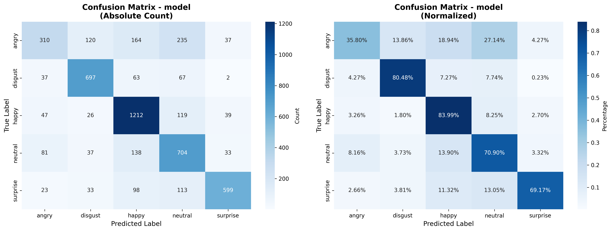
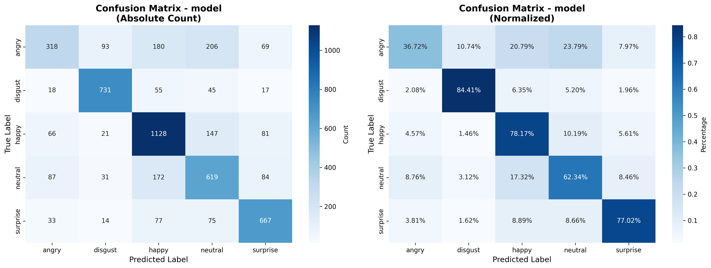
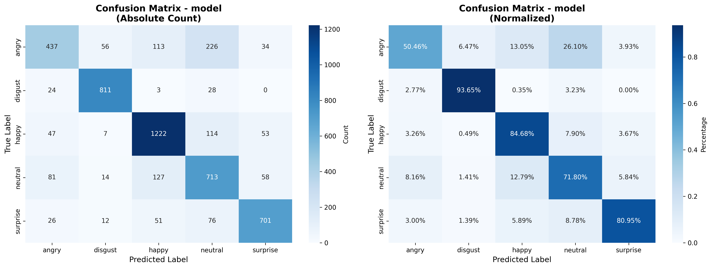

# FER2013 5-class Emotion Recognition (MobileNetV3Small)


## 🧠 개요
**FER2013 (Facial Expression Recognition 2013)** 데이터셋을 기반으로 = 5가지 감정(`angry`, `disgust`, `happy`, `neutral`, `surprise`)을 분류하는 **TensorFlow / Keras 기반 감정 인식 모델**입니다.  

MobileNetV3 Small 백본을 사용하여 모델 크기를 줄이면서도 정확도를 유지하며, 데이터 불균형, 노이즈, 미묘한 표정 차이를 목표로 **Focal Loss**, **MixUp**, **Warmup+Cosine 스케줄링** 등을 적용했습니다.

---

## 📊 FER2013 데이터셋 특성
| 항목 | 설명 |
|------|------|
| 출처 | Kaggle “Facial Expression Recognition 2013” (ICML 2013 Emotion Challenge) |
| 이미지 크기 | 48×48 grayscale (얼굴 영역 중심) |
| 클래스 수 | 7개 (본 프로젝트에서는 5개만 사용) |
| 데이터 분포 | 클래스 불균형 존재 ( disgust, surprise는 표본 수 적음) |
| 데이터 특성 | 표정 강도·조명·해상도 차이 큼, 감정 간 경계가 모호함 |

프로젝트에서는 다음과 같은 학습 기법을 적용합니다:

- **데이터 불균형 보정**: 오버샘플링 + 클래스 가중치  
- **일반화 강화**: MixUp, 랜덤 증강  
- **학습 안정화**: Warmup + Cosine 학습률 스케줄  
- **손실 함수 보강**: Focal Loss로 어려운 샘플에 가중치 부여  

## ⚖️ 모델별 학습 설정 및 성능 비교

### 📍 모델별 학습 Epoch 설정
각 모델의 복잡도 및 파라미터 수에 따라 두 단계 학습(Stage 1 / Stage 2)의 Epoch를 다음과 같이 설정했습니다
| 모델                    | Stage 1 | Stage 2 | 총 Epoch | 주요 특징           |
| --------------------- | ------- | ------- | ------- | --------------- |
| **DenseNet121**       | 15      | 30      | 45      | 중간 크기, 밀집 연결 구조 |
| **NASNetMobile**      | 20      | 30      | 50      | 복잡한 구조, 안정화 필요  |
| **MobileNetV3 Small** | 12–15   | 25–30   | 40–45   | 가장 경량, 빠른 수렴 속도 |

## 🧾 성능 비교 결과

아래는 동일 데이터셋(FER2013 5-class) 기준의 경량 모델별 평가 결과입니다.

### 🧩 DenseNet121 (Macro Average: 0.6807)


Validation Accuracy: 0.6992    
Test Accuracy:       0.6878   

### 🧩 NASNetMobile (Macro Average: 0.6773)


Validation Accuracy: 0.6875    
Test Accuracy:       0.6601    

### 🧩 MobileNetV3 Small (본 프로젝트 / Macro Average: 0.7631)


Validation Accuracy: 0.7717    
Test Accuracy:       0.7492   


**MobileNetV3 Small은 다른 두 모델 대비 학습 속도와 효율이 높고,
적은 파라미터로 유사한 정확도를 달성하여 MobileNetV3 Small를 채택**

---

## 🧩 모델 구조: MobileNetV3 Small
| 특징 | 설명 |
|------|------|
| 구조 | Depthwise Separable Convolution 기반의 경량 CNN |
| 주요 기술 | SE(Squeeze-and-Excitation) 모듈, h-swish 활성화 함수 |
| 파라미터 수 | 약 2.9M |
| 장점 | 빠르고 효율적, 모바일/엣지 디바이스에서도 실시간 추론 가능 |

**모델 설계 및 학습 전략**
- Stage 1: MobileNetV3 백본 **동결(frozen)** 후 상단 분류기 학습  
- Stage 2: 상위 60개 레이어 **언프리즈(fine-tuning)**  
- 출력부는 **Dense → Dropout → Dense**로 구성  
- 입력 이미지는 **48×48 grayscale → RGB 변환 후 128×128 리사이즈**  

---

## ⚙️ 학습 전략 개요

| 전략 | 코드 구현 | 목적 |
|------|------------|------|
| **오버샘플링** | `oversample_minority_classes()` | 클래스 불균형 완화 |
| **클래스 가중치** | `compute_class_weights_effective()` | 손실 비율 보정 |
| **MixUp 증강** | `mixup()` | 일반화 및 노이즈 대응 |
| **Focal Loss** | `FocalLoss` 클래스 | 어려운 샘플 집중 학습 |
| **Warmup + Cosine LR** | `WarmupCosine` 클래스 | 안정적 초기 학습 및 미세 조정 |
| **두 단계 학습(Stage1→2)** | `build_model(stage=1/2)` | 백본 안정화 및 fine-tuning |

---
## ⚙️ 다이어그램
<div align="center">
    
</div>

---
## 📁 폴더 구조

```
.
├─ README.md
├─ train.py                   # (본 코드)
├─ fer2013/                   # 데이터셋 루트 폴더
│   ├─ train/
│   │   ├─ angry/
│   │   ├─ disgust/
│   │   ├─ happy/
│   │   ├─ neutral/
│   │   └─ surprise/
│   └─ test/ (optional)
└─ fer2013_keras_hailo/        # 출력(모델, 로그 등)
```

---

## 🧾 데이터 준비
    - FER2013 데이터셋을 다운로드하여 `./fer2013/` 폴더에 위치시킵니다.  
    - `train/` 하위에 클래스별 폴더(`angry`, `disgust`, `happy`, `neutral`, `surprise`)를 구성합니다.  
---

## 🚀 실행 방법

```bash
python train.py
```

훈련이 시작되면 두 단계(Stage 1, Stage 2)로 모델이 학습됩니다.  
- Stage 1: MobileNetV3 백본 동결  
- Stage 2: 일부 레이어 언프리즈 후 fine-tuning  
학습 과정에서 EarlyStopping, ModelCheckpoint 콜백이 작동합니다.

---

## 🔧 주요 하이퍼파라미터

| 파라미터 | 기본값 | 설명 |
|-----------|--------|------|
| `IMG_SRC_SIZE` | 48 | 원본 이미지 크기 |
| `IMG_SIZE` | 128 | 모델 입력 크기 |
| `BATCH_SIZE` | 32 | 배치 크기 |
| `EPOCHS_STAGE1` | 25 | Stage 1 학습 epoch |
| `EPOCHS_STAGE2` | 150 | Stage 2 학습 epoch |
| `MIXUP_ALPHA` | 0.2 | MixUp 강도 |
| `VALIDATION_SPLIT` | 0.2 | 검증 데이터 비율 |
| `LOSS` | FocalLoss | 불균형 대응 손실 함수 |
| `OPTIMIZER` | Adam (clipnorm=1.0) | 학습 안정화 |
| `LR_SCHEDULE` | WarmupCosine | 학습률 스케줄링 |

---

## 📊 모델 평가
학습 종료 후 다음 결과를 출력합니다:

- **Confusion Matrix**
- **클래스별 정확도 및 Macro 평균**
- **Validation/Test 정확도**
- **최적 모델**: `best_model_float32.keras`

---

## 🧠 주요 함수 요약

| 함수 | 설명 |
|------|------|
| `load_filtered_image_paths()` | 클래스별 이미지 경로 로드 |
| `oversample_minority_classes()` | 소수 클래스 반복으로 데이터 균형화 |
| `compute_class_weights_effective()` | effective number 기반 클래스 가중치 계산 |
| `create_tf_dataset()` | tf.data 파이프라인 구성 |
| `mixup()` | 두 이미지 및 라벨의 MixUp 증강 |
| `FocalLoss` | 커스텀 포컬 로스 (α, γ 조정 가능) |
| `WarmupCosine` | 학습률 스케줄러 |
| `build_model()` | MobileNetV3Small 기반 분류기 생성 |
| `evaluate_model()` | Validation/Test 평가 |

---

## 🔁 모델 변환 및 Hailo 배포 과정

학습이 완료된 Keras 모델(best_model_float32.keras)은 TensorFlow Lite 변환 및 Hailo AI 가속기 배포를 위해 아래 단계를 거칩니다.

### 1️⃣ Keras → TFLite 변환

학습된 .keras 모델을 .tflite 형식으로 변환합니다.
이 과정은 TensorFlow의 기본 변환기를 이용하며, 추후 Hailo 변환의 입력으로 사용됩니다.


### 2️⃣ HAR → 양자화(Quantization) → HEF 변환

다음 스크립트는 Hailo-8 AI 가속기에서 사용하기 위해 Hailo SDK를 이용해 .har 모델을 양자화 → HEF 컴파일하는 전체 파이프라인을 수행합니다.
모든 과정은 ClientRunner 객체를 통해 진행됩니다.

| 기능                         | 설명                                 |
| -------------------------- | ---------------------------------- |
| **Calibration Dataset 생성** | FER2013 이미지로 1024개 샘플을 구성          |
| **HAR 로드 및 최적화**           | `.har` 파일 로드 후 모델 스크립트(`.alls`) 적용 |
| **양자화 (optimize)**         |  INT8 양자화로 모델 압축, 실제 데이터 기반 정밀도 조정                   |
| **모델 테스트**                 | 랜덤 샘플을 통한 추론 정확도 검증                |
| **HEF 컴파일 및 저장**           | Hailo-8 가속기용 실행 바이너리(`.hef`) 생성    |

### 🧩 Hailo 배포 요약

        1. ClientRunner를 통해 .har 로드
        2. Calibration 데이터로 양자화
        3. .hef 파일 생성
        4. Hailo-8 Dev Board 또는 PCIe Accelerator에 배포하여 실시간 감정 인식 수행

---


## 📚 참고 자료
- [FER2013 Dataset (Kaggle)](https://www.kaggle.com/datasets/msambare/fer2013)  
- [MobileNetV3: Searching for Efficient Neural Architectures (Howard et al., 2019)](https://arxiv.org/abs/1905.02244)  
- [Focal Loss for Dense Object Detection (Lin et al., 2017)](https://arxiv.org/abs/1708.02002)  
- [Cosine Annealing + Warmup Scheduler (Loshchilov & Hutter, 2016)](https://arxiv.org/abs/1608.03983)
- [Hailo-8 Developer Guide](https://hailo.ai/developer-zone/)
- [TensorFlow Lite Guide](https://www.tensorflow.org/lite/guide)

---


