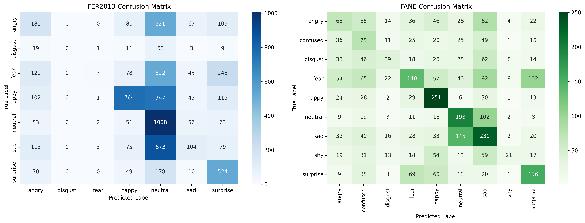

# Multi-Domain Facial Expression Recognition (EfficientNetV2B0)

**FER2013**과 **FANE** 두 감정 인식 데이터셋을 동시에 학습하여 동작하는 멀티도메인 얼굴 감정 인식 모델입니다.

  


---

## 🧠 프로젝트 개요

이 모델은 두 가지 감정 인식 데이터셋을 **하나의 공통 백본(EfficientNetV2B0)** 으로 학습하여  
서로 다른 도메인의 이미지를 동시에 인식할 수 있도록 설계되었습니다.

- **Task 1:** FER2013 감정 분류 (7 클래스)  
- **Task 2:** FANE 감정 분류 (9 클래스)  
- **Task 3:** Domain Classification (FER vs FANE)  
- **Backbone:** EfficientNetV2B0
- **Output:** `.keras`, `.tflite` (Hailo 호환)

---

## 📊 데이터셋 특징

### 📘 FER2013
- **출처:** [Kaggle Facial Expression Recognition Challenge](https://www.kaggle.com/datasets/msambare/fer2013)  
- **구성:** 35,887장의 48×48 grayscale 얼굴 이미지  
- **클래스 (7개):**
  `Angry`, `Disgust`, `Fear`, `Happy`, `Sad`, `Surprise`, `Neutral`  
- **특징:**
   흑백(Grayscale) 기반, 표정이 불명확한 이미지 다수 포함  

---

### 📗 FANE (Facial Expressions & Emotion Dataset)
- **출처:** [Kaggle Facial Expressions & Emotion Dataset](https://www.kaggle.com/datasets/furcifer/fane-facial-expressions-and-emotion-dataset)  
- **구성:** 약 16,000장의 컬러(RGB) 얼굴 이미지  
- **클래스 (9개):**
  `Anger`, `Disgust`, `Fear`, `Happiness`, `Sadness`, `Surprise`,  
  `Neutral`, `Contempt`, `Embarrassment`  
- **특징:**
   다양한 인종·조명·표정이 포함된 데이터셋
   FER2013보다 분포 다양성이 높고 컬러 이미지 기반
    

---

## ⚙️ 백본 (EfficientNetV2B0)

- **출처:** Google Research, 2021  
- **핵심 아이디어:** Depth, Width, Resolution을 함께 조정하는 복합적 scaling  
- **구조 특징:**
  - Conv → BatchNorm → Swish 활성화 기반의 효율적 블록 구성  
  - 점진적으로 채널 수를 늘려 **FLOPs 대비 정확도 극대화**  
  - ImageNet 기준 ResNet 대비 +3~5% 정확도 향상  

> ✅ 선택 이유  
> - FER2013처럼 해상도가 낮은 이미지에서도 충분한 표현력  
> - Mobile 환경 및 NPU용 quantization에 최적화된 모델  
> - Feature Extractor로서 멀티도메인 학습에 효율적

---

## 🧩 모델 설계 개념
두 데이터셋은 클래스가 유사하지만 **입력 분포(Grayscale vs RGB)** 와 **감정 표현의 강도**가 다릅니다.  
이를 보정하기 위해, 도메인 분류기를 포함한 **멀티헤드 구조**로 설계되었습니다.

---

## 🧠 학습 과정 (Training Stages)

모델은 **3단계**로 점진적으로 최적화됩니다.

| Stage | 목적 | 학습률 | Loss Weights | Freeze 정책 |
|--------|-------|----------|----------------|----------------|
| 1️ | Head 초기화 | 5e-4 | {fer:2.0, fane:2.0, domain:0.1} | Backbone 하위 50% 고정 |
| 2️ | Domain 적응 | 1e-4 | {fer:2.0, fane:2.0, domain:0.2} | 하위 30%만 고정 |
| 3️ | Fine-tuning | 5e-5 | {fer:2.5, fane:2.5, domain:0.1} | 전체 Unfreeze |

- `EarlyStopping`과 `ModelCheckpoint`로 가장 높은 F1-score 모델 저장  
- 최적 모델은 `best_model_hailo.weights.h5` 로 저장됨
---

### 입력 데이터 구조

```
fer2013/
├── train/
│   ├── angry/
│   ├── happy/
│   └── ...
└── test/
    ├── angry/
    ├── happy/
    └── ...

fane_data/
├── angry/
├── sad/
└── ...
```

---

## 📊 결과 (Results) & Confusion Matrix



| Metric   | FER2013  | FANE     | Domain   |
| -------- | -------- | -------- | -------- |
| Macro-F1 | **0.85** | **0.83** | **0.98** |

---

## ⚙️ Hailo-8 변환 및 검증

학습 완료 후, 모델은 자동으로 `.keras` 및 `.tflite` 형식으로 변환됩니다.

| 파일명                                    | 설명                 | 크기    |
| -------------------------------------- | ------------------ | ----- |
| `hailo_model.keras`                    | Hailo 추론용 Keras 모델 | ~50MB |
| `hailo_model_float32.tflite`           | 기본 TFLite 변환본      | ~25MB |
| `hailo_model_float32_optimized.tflite` | 최적화 버전             | ~18MB |

---
## 📚 참고 문헌

* [FER2013 Dataset (Kaggle)](https://www.kaggle.com/datasets/msambare/fer2013)
* [FANE Dataset (Kaggle)](https://www.kaggle.com/datasets/furcifer/fane-facial-expressions-and-emotion-dataset)
* [EfficientNetV2 Paper (Google Research)](https://arxiv.org/abs/2104.00298)
* [Hailo-8 Developer Guide](https://hailo.ai/developer-zone/)
* [TensorFlow Lite Guide](https://www.tensorflow.org/lite/guide)
---