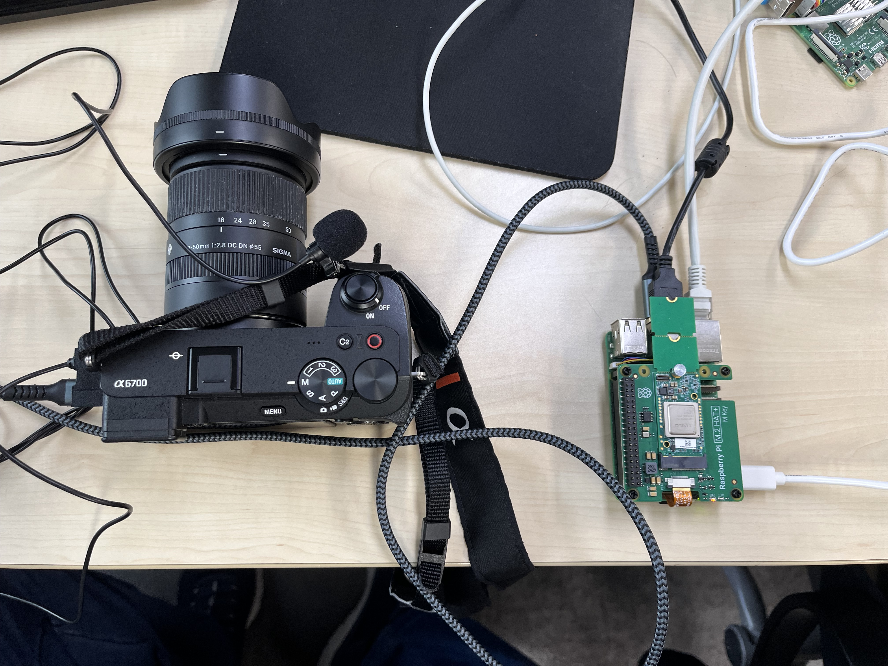

# pi\_server

`pi_server`는 라즈베리파이 5와 Hailo-8 AI 가속기를 사용하여 사용자의 데이터를 실시간으로 분석하는 RESTful API 서버입니다.

카메라와 마이크 입력을 받아 AI 모델을 통해 사용자의 포즈(자세 교정)와 표정(웃음 여부)을 실시간으로 인식하며, 클라이언트의 요청에 따라 분석 결과를 전송합니다.

 | 
---|---|

## 🏛️ 서버 아키텍처 및 설계 (Server Architecture & Design)

본 서버는 제한된 하드웨어 자원 위에서 여러 AI 모델을 안정적으로 구동하는 것을 목표로 설계되었습니다.

### 1\. 설계 목표 (Design Goals)

  * **최대 성능 활용:** Raspberry Pi 5의 CPU와 Hailo-8 NPU 자원을 최대한 효율적으로 사용하기 위해 Python의 GIL(Global Interpreter Lock) 제약을 피할 수 있는 멀티 프로세싱 아키텍처를 채택했습니다. 이를 통해 병렬 처리를 극대화하여 실시간 AI 추론 성능을 확보하고자 했습니다.
  * **안정성 및 독립성 확보:** 각 기능(영상 분배, AI 분석, 녹화)을 독립된 프로세스로 분리하여 하나의 프로세스에 문제가 발생하더라도 다른 프로세스에 영향을 미치지 않도록 설계했습니다. 이는 시스템의 전체적인 안정성을 높여줍니다.
  * **데이터 동기화:** 모든 분석 데이터는 프레임 단위의 시간(Timestamp) 정보를 포함하도록 하여, 추후 클라이언트에서 영상과 분석 결과를 정확하게 매칭할 수 있도록 동기화를 고려했습니다.

### 2\. 핵심 구조: API 서버 중심의 프로세스 관리

이 시스템의 핵심은 **Flask 기반의 API 서버**가 "Control Tower" 역할을 수행하는 것입니다. API 서버는 `ProcessManager` 클래스 인스턴스를 통해 모든 자식 프로세스(RTSP, AI 추론, 녹화 등)의 생성과 소멸을 직접 관리합니다.

### 3\. 주요 컴포넌트 상세

  * **Flask API 서버 (`server.py`):**

      * **역할:** 시스템의 메인 엔트리 포인트이자 모든 동작을 제어하는 중앙 컨트롤러입니다.
      * **동작:** 클라이언트로부터 `/command/start_record`, `/command/stop_record`와 같은 HTTP GET 요청을 받아 `ProcessManager`의 메서드를 호출합니다. 이를 통해 각 자식 프로세스의 전체 생명주기(시작, 종료, 데이터 취합)를 오케스트레이션합니다. 또한 `/download/` 엔드포인트를 통해 클라이언트가 결과 파일을 다운로드할 수 있도록 합니다.

  * **프로세스 관리자 (`ProcessManager`):**

      * **역할:** `subprocess.Popen`을 이용하여 실제 작업을 수행하는 Python 스크립트들을 별도의 프로세스로 생성하고 관리하는 클래스입니다.
      * **동작:** 각 프로세스의 `Popen` 객체를 인스턴스 변수로 유지하며, 프로세스 시작(`*_start`) 및 안전한 종료(`*_finish`)를 위한 메서드를 제공합니다. 특히 종료 시에는 `SIGINT`, `SIGTERM`, `SIGKILL` 신호를 단계적으로 사용하여 프로세스가 정상적으로 정리될 수 있도록 보장하는 로직이 포함되어 있습니다.

  * **영상 분배기 (RTSP 프로세스):**

      * **역할:** GStreamer를 이용하여 카메라 입력을 받아 RTSP(Real Time Streaming Protocol) 서버를 구축합니다.
      * **동작:** 단 한 번의 인코딩만으로 생성된 영상 스트림을 여러 AI 분석기 및 녹화기 프로세스에서 구독(subscribe)하여 사용할 수 있도록 합니다. 이는 CPU 자원의 중복 사용을 막는 핵심적인 역할을 합니다.

  * **AI 분석기 (표정/자세 추정 프로세스):**

      * **역할:** RTSP 서버로부터 영상 스트림을 받아 Hailo-8 NPU를 활용해 AI 추론을 수행하고, 결과를 `srv_tmp/xml/` 경로에 개별 `xml` 파일로 저장합니다.
      * **XML 파일 크기 제어:** 프레임 단위의 연속적인 데이터 기록으로 `xml` 파일이 비대해지는 것을 막기 위해, 특정 행동이 감지되면 2초간 동일 행동에 대한 기록을 멈추는 쓰로틀링(throttling) 로직이 적용되어 있습니다.

  * **녹화기 (Recorder 프로세스):**

      * **역할:** RTSP 서버로부터 영상 스트림을 받아 `/srv_tmp/mp4/video.mp4`로, 마이크 입력을 받아 `/srv_tmp/wav/audio.wav`로 저장하는 단순 녹화 기능을 수행합니다.

  * **데이터 취합 (XML Mixer 프로세스):**

      * **역할:** 클라이언트에서 `stop_record` API를 호출하면 실행되는 **최종 단계**입니다.
      * **동작:** `ProcessManager`가 모든 녹화 및 분석 프로세스를 종료시킨 후, `xml_mix()` 메서드를 통해 별도의 임시 프로세스를 실행합니다. 이 프로세스는 `srv_tmp/xml/` 경로에 생성된 `f_log.xml`과 `p_log.xml`을 하나로 병합하여 최종 결과물인 `/srv_tmp/xml/log.xml`을 생성합니다.

### 4\. 기술 선택 및 근거 (Technical Choices & Rationale)

  * **GStreamer:** RTSP 서버 구축이 용이하고 다양한 카메라 하드웨어를 유연하게 지원하며, 무엇보다 Hailo 측에서 공식적으로 권장하는 미디어 프레임워크이기 때문에 채택했습니다.
  * **멀티 프로세싱 (`subprocess`):** Python의 GIL 제약을 회피하고 멀티코어 CPU와 NPU를 최대한 활용하기 위해 멀티 스레딩 대신 멀티 프로세싱을 선택했습니다. 각 기능의 독립성을 보장하여 안정성을 높이는 효과도 있습니다.
  * **XML 포맷:** JSON과 달리 줄 바꿈, 공백 등 사소한 문법 오류에 비교적 덜 민감하여 데이터 구조의 안정성을 확보하고 파싱 오류 가능성을 최소화하기 위해 채택했습니다.
  * **Hailo NPU API 제약사항:** 현재 HailoRT의 Python API는 비동기 추론 시 단일 출력(single output) 모델만 지원합니다. 얼굴 Bounding Box 추론 모델처럼 다중 출력(multi-output)을 가진 모델을 비동기 방식으로 효율적으로 처리하는 데 제약이 있어, OpenCV(CPU)를 사용하는 방식을 택하되 비동기적으로 처리되는 구조를 택했습니다. ([관련 Hailo 커뮤니티 토론](https://community.hailo.ai/t/issue-with-running-multiple-output-model/2289/5))